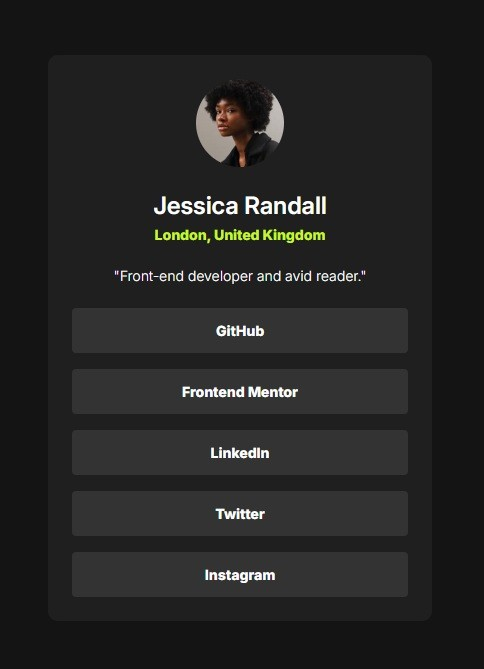

# Frontend Mentor - Social links profile solution

This is a solution to the [Social links profile challenge on Frontend Mentor](https://www.frontendmentor.io/challenges/social-links-profile-UG32l9m6dQ). Frontend Mentor challenges help you improve your coding skills by building realistic projects. 

## Table of contents

- [Overview](#overview)
  - [The challenge](#the-challenge)
  - [Screenshot](#screenshot)
  - [Links](#links)
- [My process](#my-process)
  - [Built with](#built-with)
  - [What I learned](#what-i-learned)
  - [Useful resources](#useful-resources)

## Overview

### The challenge

Users should be able to:

- See hover and focus states for all interactive elements on the page

### Screenshot

### Links

- Solution URL: [https://github.com/thenotoriousob/social-links-profile]
- Live Site URL: [Add live site URL here](https://your-live-site-url.com)

## My process

### Built with

- Semantic HTML5 markup
- SAAS
- Flexbox
- Mobile-first workflow

### What I learned

How to compile SAAS files
SAAS variables
SAAS use
SAAS mixins/includes
SAAS extend
SAAS nesting

### Useful resources

- [Beginners guide to SASS](https://www.freecodecamp.org/news/the-beginners-guide-to-sass/) - This gave me an initial understanding of how SASS works
- [SASS tutorial](https://www.geeksforgeeks.org/sass/) - This went into SASS in a bit more detail and enhanced my understanding

